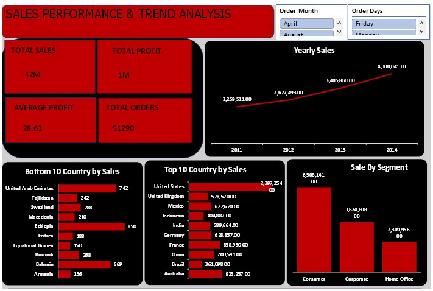
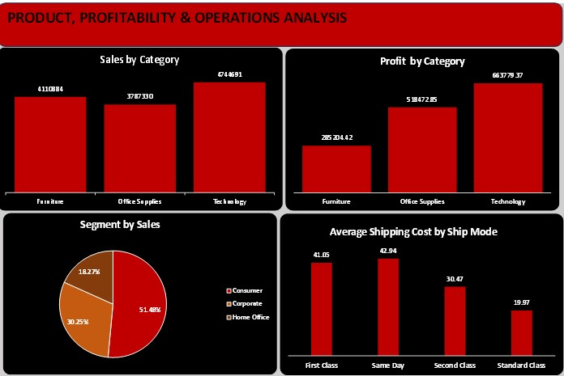

# Global-Superstore-Sales-Operations-Dashboard

## 📌 Project Overview
This project analyzes the **Global Superstore dataset** to evaluate sales performance, profitability, customer segments, and operational efficiency.  
The analysis is presented using two interactive dashboards designed for business decision-making.
---

## 🎯 Objectives
- Analyze overall sales and profit performance
- Identify sales trends over time
- Detect top-performing and underperforming countries and products
- Evaluate profitability across product categories
- Assess shipping cost efficiency by ship mode
---

## 🧾 Dataset
The dataset contains global transactional sales data including:
- Orders, customers, and products
- Sales, profit, discounts, and shipping cost
- Geographic and customer segment information
- Shipping modes and order priority

---

## 📊 Dashboard Structure

### 1️⃣ Sales Performance & Trend Analysis

**KPIs**
- Total Sales: 12M  
- Total Profit: 1M  
- Average Profit: 28.61  
- Total Orders: 51,290  

**Visuals**
- Yearly Sales Trend
- Top & Bottom Countries by Sales
- Sales by Customer Segment

**Key Insight**
> Sales show consistent year-over-year growth, with revenue concentrated in a few major markets.

---

### 2️⃣ Product, Profitability & Operations Analysis

**Visuals**
- Sales by Category
- Profit by Category
- Segment Contribution to Sales
- Average Shipping Cost by Ship Mode

**Key Insights**
- Technology products generate the highest sales and profit
- Furniture has high sales but relatively low profitability
- Same-day and first-class shipping significantly increase costs
---

## 🧠 Business Insights
1
- Focus growth efforts on high-profit categories (Technology)
- Optimize shipping strategy to reduce logistics costs
- Strengthen presence in top-performing countries
- Reassess strategy for low-revenue regions

---

## 🛠 Tools Used
- Microsoft Excel
- Power Query (M-Language)
- Data Visualization & Dashboard Design
- GitHub (Documentation & Portfolio)

## 📎 Author
Developed as part of a data analytics learning and portfolio project using real-world business data.
